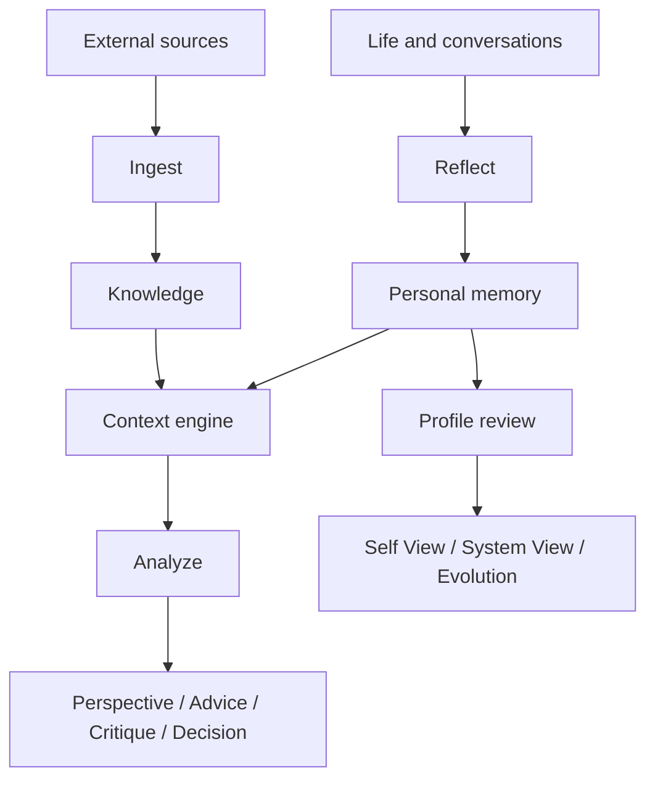

# Personal OS

**A local-first, evidence-aware personal memory and reasoning system built on Markdown.**

[中文快速了解](#中文快速了解) · [Quick start](#quick-start) · [Architecture](docs/architecture.md) · [Privacy](#privacy)

Personal OS is the system I wanted after realizing that chat history is not memory.

Chats are useful while they are happening. They are much less useful months later, when I want to know what actually happened, what I decided, why I decided it, and whether the result proved me right. A long transcript rarely answers those questions cleanly. It also mixes my words, the assistant's suggestions, and later interpretations into one stream.

I built Personal OS to keep those things separate.

It stores durable personal records in a Markdown vault that I own. Codex skills help me reflect on experiences, import external knowledge, retrieve only the context relevant to a question, analyze that question, and review how my profile has changed. The index can be rebuilt. The AI client can be replaced. The history remains readable without either one.

> Chat history is not memory.

> A current profile should not rewrite history.

> An AI observation is not a user fact.

> The vault should survive the AI client.

The current public release is **v0.1.0**. It is primarily tested on Windows with Codex.

## 中文快速了解

Personal OS 是我为自己做的一套本地个人记忆与推理系统。它不是把聊天记录全部存下来，也不是给 Obsidian 接一个普通问答工具。

我真正想保留的是一条能够追溯的链：我经历了什么，当时面对什么选择，为什么这样选，后来结果如何，以及这些结果是否改变了我对自己的理解。

系统把长期数据保存在用户自己的 Markdown Vault 中。SQLite、全文索引和向量只是可以删除后重建的检索缓存。个人数据不依赖某一个 AI 客户端才能继续存在。

五个 Skill 分别负责：

- `$reflect`：把当前对话、旧材料或补充信息整理成 Experience、Decision、Outcome、Profile 或 Model。
- `$ingest`：导入网页、PDF、EPUB、DOCX 或文本，同时保留原始来源和知识笔记之间的边界。
- `$context`：围绕当前问题，按预算加载相关个人历史和外部知识。
- `$analyze`：结合证据分析问题，但默认不写入长期记忆。
- `$profile-review`：比较 Self View 与 System View，在明确确认后才提交长期档案变化。

我特别在意几条边界：用户明确说过的话不能和 AI 推断混在一起；书中的观点不能变成用户的信念；历史状态不能被今天的 Profile 覆盖；一次分析也不能在后台悄悄变成长期记忆。

如果你也希望几年后仍能回答“我当时为什么这么做，后来发生了什么，我现在又为什么改变了”，这套系统可能适合你。

## Why I built this

Most AI memory systems begin with the question: how can the assistant remember more?

I began with a different question: what is worth preserving, and what would make it trustworthy years later?

I wanted to distinguish:

- something I explicitly said from something an AI inferred;
- an event from the conversation in which I described it;
- the date an event happened from the date I recorded it;
- a decision from its later outcome;
- my current view from a view I held in the past;
- an author's claim from a third-party summary or my own reflection;
- evidence retrieved for analysis from memory I intentionally chose to save.

Those distinctions matter more to me than collecting a larger volume of text. A system that remembers everything but loses provenance is difficult to trust. A system that continually rewrites a single profile loses the very history that could explain change.

I also did not want my personal record to live inside one assistant's private memory format. Codex is the current working client, but the durable data is ordinary Markdown with YAML frontmatter and Wikilinks. Another client can read the same files later.

## What it is

Personal OS consists of three parts:

1. **Five Codex Agent Skills** that define when and how memory, retrieval, reasoning, and review happen.
2. **A local Python runtime** for safe writes, ingestion, indexing, retrieval, context assembly, and validation.
3. **A user-owned Markdown vault** containing the durable personal record and external knowledge.

**Who is this for?** People who use AI over the long term for learning, work, analysis, and decisions, and want to own the resulting personal history. It is probably more than you need if you only want chat search or simple question answering over an Obsidian vault.



The skills are orchestration layers. They do not replace the vault. The runtime is infrastructure. It can rebuild its index from the files in the vault.

The data model includes Profile, Experience, Decision, Outcome, Goal, Constraint, Principle, Project, Model or AI Observation, Knowledge, Source Evidence, and Profile History.

This is not a background life logger. Nothing is automatically turned into memory merely because it appeared in a chat.

## The core loop

The center of the system is not a profile. It is this chain:

```text
Experience
    ↓
Decision
    ↓
Outcome
    ↓
Reflection
    ↓
Profile or Model change, when the evidence supports it
```

An Experience records what happened. A Decision records the options, constraints, assumptions, trade-offs, and choice visible at the time. An Outcome is added later, when reality has had a chance to answer back.

That separation lets the system ask better questions:

- Did the outcome support the original reasoning?
- Did the decision work only because the context was different?
- Has a repeated pattern earned a place in the current Profile?
- Is a new AI observation still tentative, contradicted, or obsolete?

The Profile remains a compact description of the current, relatively stable state. Earlier states belong in Profile History and in the Experiences and Decisions that explain them.

External knowledge joins the loop without becoming personal memory. A book can challenge a decision. A paper can supply evidence. A case can suggest an option. None of them automatically describes the user.

## The five Skills

| Skill | What I use it for | Writes? | Example |
|---|---|---:|---|
| `$reflect` | Preserve a current experience, backfill old material, or update an existing record | Yes, explicitly | “沉淀本次对话” |
| `$ingest` | Import one external source with provenance | Yes, explicitly | “把这篇论文导入 Personal OS” |
| `$context` | Build a bounded, source-aware Context Pack | No | “加载跟这个选择有关的个人背景” |
| `$analyze` | Analyze from personal history and external evidence | No | “站在我的历史视角分析，再挑战我的假设” |
| `$profile-review` | Compare Self View, System View, and change over time | Read-only by default | “重新认识我，并给出证据” |

### `$reflect`: deliberate memory

`$reflect` has three modes, usually inferred from natural language:

- **current** records something that happened in the current conversation or current period;
- **backfill** processes an old chat, diary, project record, or remembered event without pretending it happened today;
- **update** adds evidence, correction, or an Outcome to an existing stable record.

Before writing, it searches for related records. Repeating the same material should become a no-op or an update rather than another Experience. Ambiguous similarity is not enough to merge two events.

Every long-term assertion keeps its origin distinguishable: user explicit, behavior inferred, AI observation, system record, self-authored material, or external source. Write-safety details are covered in [Memory Model](docs/memory-model.md).

### `$analyze` and `$profile-review`: reasoning without silent memory

`$analyze` supports perspective, analysis, advice, critique, and decision modes. It separates the user's evidence-backed historical perspective, external evidence, and the AI's current analysis or challenge. It is read-only: a useful inference does not become memory until the user asks `$reflect` to preserve it.

`$profile-review` asks a slower question: how has my understanding of myself changed? It keeps two views beside each other:

- **Self View**: what I explicitly say about myself;
- **System View**: what the system tentatively observes from repeated evidence.

For example:

> **Self View:** I prefer stable plans.
>
> **System View:** In several recent decisions, you accepted uncertainty when it preserved long-term options. This may indicate that optionality now matters more than predictability.

The second statement is not promoted to fact. A review checks evidence and uncertainty, then remains read-only until the user explicitly confirms which changes to commit.

Detailed behavior is documented in [Memory Model](docs/memory-model.md), [Personal Reasoning](docs/personal-reasoning.md), and [Profile Evolution](docs/profile-evolution.md).

## What makes it different

### Chat history is not memory

A transcript is source material. Durable memory is selected, typed, linked, dated, and written because the user asked for it.

### A current profile should not rewrite history

The current Profile can change. The earlier view, its evidence, and the transition remain available in Profile History and dated records.

### A book is not a user belief

Knowledge keeps the identity of its source. Original material, extracted source information, third-party summary, AI summary, and personal reflection are different things.

### An AI observation is not a user fact

AI observations carry confidence, status, evidence, and counter-evidence. They can be strengthened, weakened, contradicted, or retired.

### Indexes should be disposable

SQLite FTS data, embeddings, caches, and chunks are derived artifacts. Deleting them must not delete the durable record.

### Analysis should not silently become memory

Retrieval and reasoning are read-only. Reflection and confirmed profile review are the write paths.

### Profile changes should require evidence and confirmation

The system can propose change. It cannot quietly decide who the user has become.

### The vault should survive the AI client

The storage model is client-independent Markdown. The present skills are tested primarily with Codex; the personal history is not stored in a Codex-only database.

## A typical flow

You finish a difficult project discussion.

You say: **“沉淀本次对话。”**

`$reflect` finds an existing Project and Decision.

It creates one Experience, updates the Decision, and preserves the evidence links.

A month later, the result is known.

You say: **“补充一下我上次那个项目决定的结果。”**

The original reasoning remains unchanged; the Outcome is appended with its later date.

You import a relevant article.

`$ingest` stores the source identity and creates a Knowledge note without treating the article as your opinion.

Before the next choice, you say: **“加载和这个问题有关的个人背景。”**

`$context` retrieves a bounded set of current goals, related decisions, outcomes, and external knowledge.

Source evidence stays out unless the question needs a quotation or page reference.

You then say: **“从我的历史视角分析，但专门指出我可能忽略的地方。”**

`$analyze` separates your historical perspective, external evidence, and its own challenge.

It does not write anything back.

Later, you run `$profile-review`.

The review finds a possible shift from stability toward optionality, cites supporting and opposing evidence, and asks for confirmation.

Only the changes you approve enter the long-term Profile and Profile History.

## Quick start

### Requirements

The current reference environment is:

- Windows 11;
- PowerShell and Git;
- Python 3.11–3.13, recorded release environment 3.13.5;
- Node.js 20.19 or later, recorded release environment 20.20.2;
- Codex with the standard local skills layout.

Obsidian is the recommended Markdown and Vault interface, but the Quick Start does not require the desktop app to be running.

macOS, Linux, and other AI clients are not yet formally tested.

### 1. Clone and bootstrap

```powershell
git clone https://github.com/Iuanin666/personal-reasoning-os.git
cd personal-reasoning-os
powershell -ExecutionPolicy Bypass -File .\scripts\setup.ps1
powershell -ExecutionPolicy Bypass -File .\scripts\create-demo.ps1
powershell -ExecutionPolicy Bypass -File .\scripts\install-skills.ps1 -VaultPath "$PWD\work\demo-vault"
```

`setup.ps1` bootstraps the local runtime: it creates the isolated Python environments, installs the locked dependencies, runs `npm ci` for the pinned Defuddle package, and downloads the local embedding model. Demo creation, Skill installation, indexing, and validation remain explicit steps.

### 2. Build the demo index

```powershell
.\scripts\pos.ps1 rebuild -VaultPath "$PWD\work\demo-vault"
```

### 3. Validate the installation

```powershell
.\scripts\pos.ps1 validate -VaultPath "$PWD\work\demo-vault"
```

### 4. Try the skills in Codex

The included demo vault is entirely synthetic. It belongs to a fictional user and does not contain adapted private data.

Try:

```text
加载与 Lin 最近职业选择有关的个人背景。
```

```text
按照 Lin 的历史视角分析这个选择，然后挑战其中的假设。
```

```text
比较 Lin 的 Self View 和 System View，不要提交修改。
```

Or in English:

```text
Based on my past decisions, help me analyze whether I should accept this project.
```

```text
Analyze this from my perspective, then challenge my assumptions.
```

For the runtime layout and configuration model, see [Architecture](docs/architecture.md) and the comments in [`scripts/setup.ps1`](scripts/setup.ps1).

## Under the hood

The runtime stays local and treats Markdown with YAML frontmatter as the durable source of truth. Writes are validated and published atomically; compare-and-swap checks prevent a stale process from overwriting a newer Obsidian edit.

Retrieval combines SQLite FTS5 with a local multilingual embedding model through reciprocal-rank fusion. The index updates incrementally, keeps results traceable to their source headings, and can be deleted and rebuilt from the vault. Context Packs then apply separate budgets to personal memory, knowledge, and source evidence instead of sending the whole vault to the model.

Complete books and papers are split into two physical layers. A compact Knowledge note holds metadata, outline, derived knowledge, and optional summaries or reflections. The managed source directory holds the original file, extraction, manifest, citations, and provenance. Source evidence is searchable when needed but does not compete equally with personal memory in ordinary questions.

Implementation details are in [Retrieval](docs/retrieval.md), [Knowledge Ingestion](docs/knowledge-ingestion.md), [Context Engine](docs/context-engine.md), and [Architecture](docs/architecture.md).

## Privacy

Personal OS is local-first, not magically private.

The user owns the vault and chooses when to invoke a write skill. The reference implementation does not require a cloud database or a paid API, and it does not automatically upload the vault. Indexes and caches remain local by default, but they may contain sensitive excerpts and should be protected and excluded from public repositories.

When an AI client reads a Context Pack, the selected excerpts enter that client's working context. The exact data handling therefore also depends on the client and the user's environment. This project does not claim that no AI service can ever see the data.

Other safeguards are structural:

- Source Evidence is separated from higher-level Knowledge;
- AI observations remain distinct from user facts;
- `$context`, `$analyze`, and the proposal stage of `$profile-review` are read-only;
- profile commits require explicit confirmation;
- normal writes use compare-and-swap checks to avoid overwriting concurrent Obsidian edits;
- the public repository includes only synthetic data.

Before reporting a bug, create a synthetic reproduction. Do not attach a real vault, source document, index, log, or screenshot containing private material. See [Privacy Model](docs/privacy-model.md) and [Security](SECURITY.md).

## Limitations

- The public release is primarily tested on Windows and Codex.
- Retrieval quality depends on the content and structure of the user's own vault.
- Local embeddings require an initial model download and consume disk space and memory.
- OCR quality and complex document extraction depend on upstream tools such as Docling and Defuddle.
- `$analyze` can organize evidence and challenge assumptions; it cannot guarantee a better decision.
- Profile Review proposes interpretations from available records. Missing records can make those interpretations incomplete.
- The system does not automatically monitor conversations, files, or life events.
- It does not provide a GUI, cloud sync, multi-user access, or a hosted service.
- Client-independent storage does not mean every AI client has a tested integration.

These limits are deliberate for the first public release. The priority is a small, auditable foundation whose data remains readable and migratable.

## Documentation

- [Architecture](docs/architecture.md)
- [Memory Model](docs/memory-model.md)
- [Knowledge Ingestion](docs/knowledge-ingestion.md)
- [Retrieval](docs/retrieval.md)
- [Context Engine](docs/context-engine.md)
- [Personal Reasoning](docs/personal-reasoning.md)
- [Profile Evolution](docs/profile-evolution.md)
- [Privacy Model](docs/privacy-model.md)
- [Open Source Design](docs/open-source-design.md)

The repository also contains synthetic evaluation cases and the evaluation framework. Private internal evaluation data is not included.

## Contributing

Issues and pull requests are welcome for reproducible bugs, schema compatibility, Windows installation, retrieval evaluation, documentation, and focused improvements to the five skills.

Please use synthetic fixtures. Never upload a real Personal OS vault, managed source, index, cache, conflict artifact, or private evaluation case to an issue or pull request.

Schema changes should preserve backward compatibility or include an explicit migration. Behavioral changes should include tests that show the intended source, time, and write-safety semantics.

See [CONTRIBUTING.md](CONTRIBUTING.md).

## License

Personal OS is released under the [MIT License](LICENSE).

Third-party dependencies and design references are documented in [THIRD_PARTY_NOTICES.md](THIRD_PARTY_NOTICES.md).
