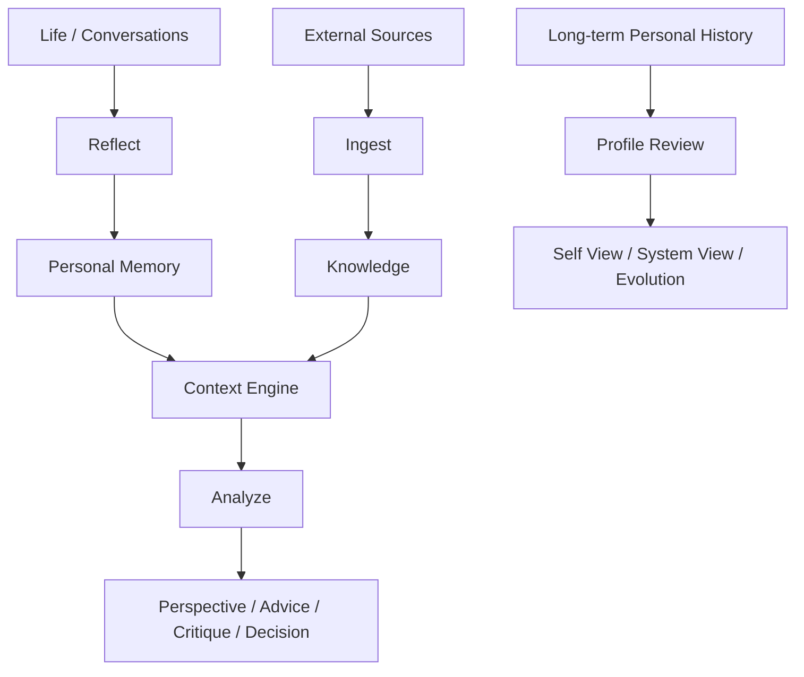

# Personal OS

**A local-first, evidence-aware Personal Memory & Reasoning OS built on Markdown.**

Personal OS turns experiences, decisions, outcomes, external knowledge, and explicit self-reflection into an auditable Markdown record. It retrieves only relevant evidence for a question, keeps source identities separate, and tracks how **Self View** and **System View** change over time.

This repository is the first public release after several private implementation iterations. It contains only code, schemas, synthetic evaluation data, and a completely fictional demo vault.

## Why this is more than Obsidian RAG

1. **Personal Memory** — Experience, Decision, and Outcome are durable records, not chat summaries.
2. **Knowledge Ingestion** — original sources, third-party summaries, AI summaries, and personal reflections retain different identities.
3. **Evidence-aware Context** — bounded Context Packs select relevant evidence instead of loading an entire vault.
4. **Personal Reasoning** — perspective, analysis, advice, critique, and decision modes remain read-only.
5. **Self View vs System View** — what a user explicitly says about themselves remains separate from evidence-based system observations.
6. **Profile Evolution** — review checkpoints preserve change; causal explanations are graded instead of asserted.



## Privacy model

- Markdown is the long-term source of truth. The user owns and chooses where to store the vault.
- SQLite FTS, embeddings, chunks, and caches are disposable and rebuildable.
- The reference implementation does not require a cloud database or paid API.
- It does not automatically upload a vault. Data read by an AI client is still visible to that client under the client's own privacy terms.
- full extracted documents live in `source_evidence`; ordinary Knowledge notes remain compact.
- AI Observation is not a user fact. Profile Review is read-only until the user explicitly confirms selected changes.

The data model and Markdown storage are client-independent. The current reference implementation and skills are primarily tested with Codex.

## Quick start on Windows

Requirements: Windows 11, PowerShell 7+, Git, Python 3.11–3.13, and Node.js 20.19+. Obsidian is recommended for viewing and editing the vault. macOS and Linux have not yet been formally tested.

```powershell
git clone <YOUR-REPOSITORY-URL>
cd personal-reasoning-os
./scripts/setup.ps1
./scripts/create-demo.ps1
./scripts/install-skills.ps1 -VaultPath "$PWD/work/demo-vault"
./scripts/pos.ps1 index -VaultPath "$PWD/work/demo-vault"
./scripts/pos.ps1 validate -VaultPath "$PWD/work/demo-vault"
```

`setup.ps1` creates isolated Python environments, installs exact locked dependencies, installs Defuddle 0.19.4, and downloads the pinned local embedding model. Docling is isolated in `.venv-ingest`.

## Skills

- `$reflect`: current, backfill, and update modes with deduplication and dual-time semantics.
- `$ingest`: one URL/PDF/EPUB/DOCX/text source with managed-source provenance.
- `$context`: bounded, sourced Context Packs.
- `$analyze`: read-only personal reasoning with three clearly separated voices.
- `$profile-review`: read-only review followed by explicit, selected CAS commit.

Example prompts:

- “Based on my past decisions, help me analyze whether I should accept this project.”
- “Analyze this problem from my perspective, then challenge my assumptions.”
- “Compare how I see myself with how the system currently sees me.”
- “How has my decision-making style changed over time?”
- “结合我过去的决定，分析我是否应该接受这个项目。”
- “先按我的思维方式分析，再专门挑战我的假设。”
- “比较我怎么看自己，以及系统根据证据怎么看我。”
- “我的决策方式这些年发生了什么变化？”

## Storage and retrieval

```text
Obsidian Markdown = Source of Truth
SQLite + FTS5 + local multilingual embeddings = Disposable Index
Codex or another client = Reasoning / Working Client
```

Retrieval uses keyword and semantic candidates, reciprocal-rank fusion, type/authority-aware ranking, note diversity, bounded relationship expansion, and evidence-status diagnostics. Source evidence is physically and logically separated from normal personal context.

## Documentation

- [Architecture](docs/architecture.md)
- [Memory model](docs/memory-model.md)
- [Knowledge ingestion](docs/knowledge-ingestion.md)
- [Retrieval](docs/retrieval.md)
- [Context engine](docs/context-engine.md)
- [Personal reasoning](docs/personal-reasoning.md)
- [Profile evolution](docs/profile-evolution.md)
- [Privacy model](docs/privacy-model.md)
- [Open-source design](docs/open-source-design.md)

## Current tested environment

- Windows 11
- Python 3.13.5 for the recorded release tests
- Node.js 20.20.2
- Codex Agent Skills layout under `%USERPROFILE%\.codex\skills`
- Obsidian desktop with an enabled local vault; the exact desktop build was not reliably exposed to the test sandbox
- macOS/Linux: not yet formally tested

## Scope and limits

Personal OS does not claim to understand a person's “true personality,” guarantee better decisions, provide complete memory, or eliminate hallucinations. Its goals are evidence awareness, auditability, user control, explicit triggering, and source identity.

## License

Personal OS original code is available under the MIT License. Third-party tools remain under their own licenses; see [THIRD_PARTY_NOTICES.md](THIRD_PARTY_NOTICES.md).
